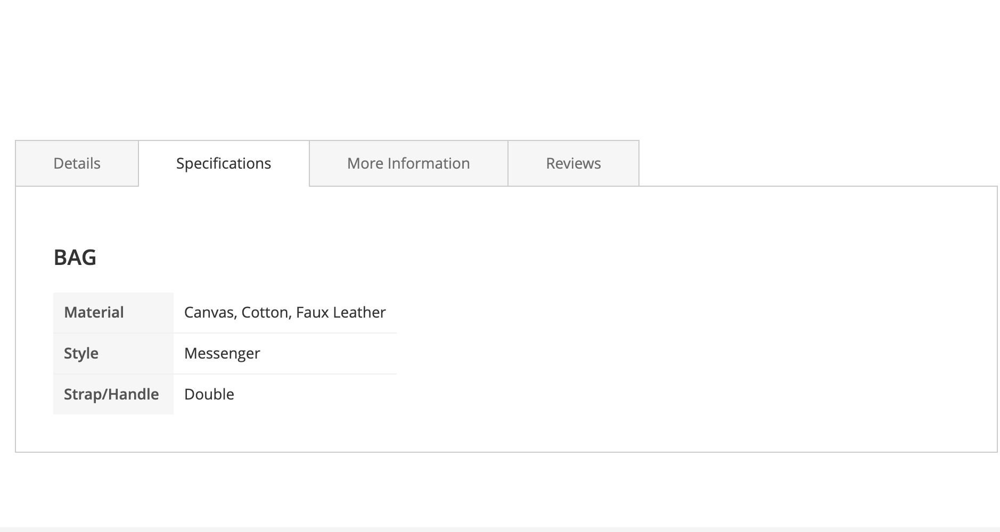
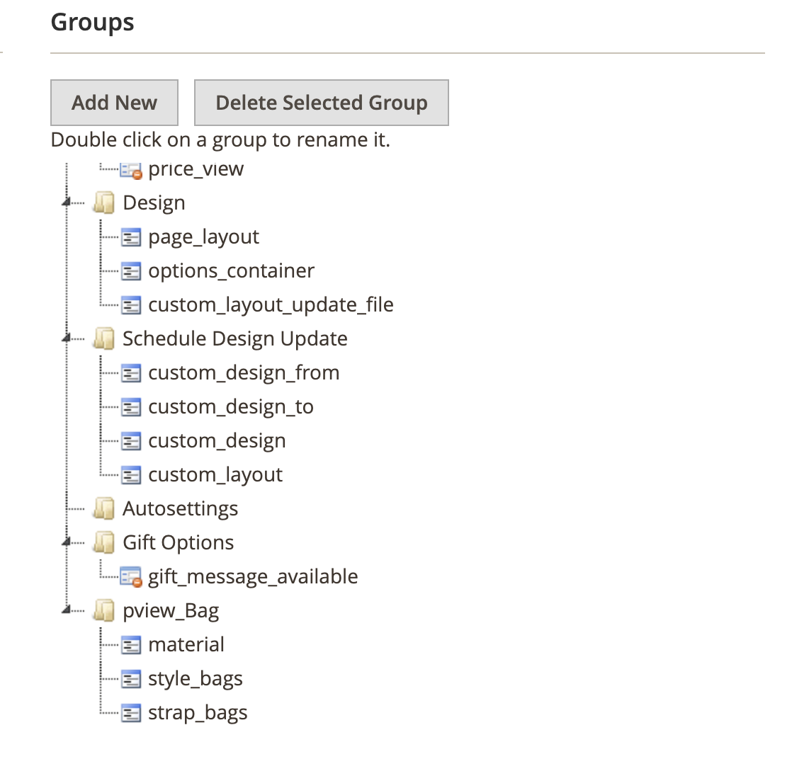
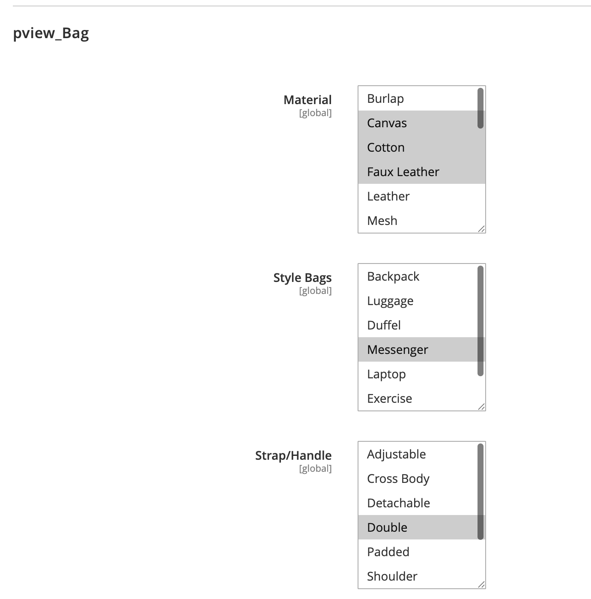

# Lobbster_ProductViewAttributeGroups

Magento 2 module that renders product attributes on the product view page **grouped by Attribute Groups** (from the product's Attribute Set). Only groups whose name starts with a configurable prefix (default: `pview_`) are shown. Within each group, only attributes that have a non-empty value for the current product are displayed.



*Frontend: Specifications tab with a custom group title (e.g. "BAG") and its attributes.*

## How it works

### Data flow

1. **Block** (`AttributeGroups`) extends `Template` and is used for cache keys/tags only. It delegates to a **ViewModel** injected via layout; the ViewModel gets the current product via `Magento\Catalog\Helper\Data`.

2. **ViewModel** (`AttributeGroups`) checks if the module is enabled for the store. If enabled, it calls **GroupProvider** to fetch groups and attributes. The ViewModel also provides `Magento\Catalog\Helper\Output` for rendering attribute values (HTML, wysiwyg, etc.).

3. **GroupProvider** loads EAV attribute groups from the product's attribute set, filters by prefix, resolves attributes with values, and returns a structured array. Group structure (per attribute set/store/config) is cached in app cache; block HTML is cached by Magento.

4. **Template** renders the groups as HTML tables (same structure as core "More Information" block) with null-safe access to all values.

### Group selection logic

- Only groups whose **name** or **code** starts with the configured prefix (e.g. `pview_`) are considered.
- Group title is taken from `attribute_group_name`; if empty, `attribute_group_code` is used.
- Groups are sorted by `sort_order` from the attribute set.
- A group is included only if it has **at least one attribute** with a non-empty frontend value for the current product.

### Attribute selection logic

For each matching group:

- Attributes are loaded from the EAV `entity_attribute` join (group + attribute set).
- If **Require Visible on Front** is enabled, only attributes with `is_visible_on_front = 1` are included.
- Attributes in the **denylist** (comma-separated codes) are excluded.
- Attributes with empty frontend value (after `getFrontend()->getValue()`) are skipped.
- Price attributes are formatted via `PriceCurrencyInterface`.
- Boolean attributes with no value are treated as empty.
- Attributes are sorted by `entity_attribute.sort_order`.

### Group title formatting

**TitleFormatter** converts the raw group name into a display title:

1. Strip the prefix (e.g. `pview_Truck` → `Truck`).
2. Replace underscores/hyphens with spaces.
3. Apply UTF-8 title case.

Examples: `pview_Truck` → **Truck**, `pview_Technical_Specs` → **Technical Specs**.

### Attribute value resolution

**AttributeValueResolver** uses the attribute's frontend model to get the value. Price attributes are converted and formatted for the current store. Empty strings, `null`, and (for booleans) missing raw values are treated as empty and excluded.

---

## Install and enable

```bash
bin/magento module:enable Lobbster_ProductViewAttributeGroups
bin/magento setup:upgrade
bin/magento cache:flush
```

For static content (themes using Less):

```bash
bin/magento setup:static-content:deploy
```

---

## Configuration

**Stores → Configuration → Catalog → Catalog → Product Attribute View Groups**

| Path | Description | Default |
|------|-------------|---------|
| **Enable Attribute Groups on Product View** | Turn the block on/off | Yes |
| **Attribute Group Name Prefix** | Only groups whose name/code starts with this prefix are shown | `pview_` |
| **Require Visible on Front** | Only include attributes with "Visible on Catalog Pages on Storefront" = Yes | Yes |
| **Attribute Codes Denylist** | Comma-separated attribute codes to never show (e.g. `sku`, `url_key`) | (empty) |

Config path (for `config:set` / scope): `catalog/product_view_attribute_groups/<field>`.

---

## Creating groups in Admin

1. Go to **Stores → Attribute Set** (or **Stores → Attributes → Attribute Set**).
2. Edit or create an attribute set used by your products.
3. Add or rename a group so its **name** (or code) starts with the configured prefix, e.g.:
   - `pview_Bag`
   - `pview_Truck`
   - `pview_Technical_Specs`
4. Assign attributes to that group (text, dropdown, boolean, date, price, etc.).
5. Ensure those attributes have **Visible on Catalog Pages on Storefront** = Yes (unless **Require Visible on Front** = No).
6. Save the attribute set.

Group titles are derived automatically: prefix stripped, then prettified (e.g. `pview_Bag` → **Bag**).



*Admin: Groups in an attribute set. The `pview_Bag` group contains attributes such as material, style_bags, strap_bags.*



*Admin: Configuring attributes inside the pview_Bag group (Material, Style Bags, Strap/Handle).*

---

## Placement and rendering

- The block is added as a child of `product.info.details`, in the `detailed_info` group, so it appears in the same tabbed/stacked area as Description and More Information (theme-dependent).
- Default layout: inserted **before** `product.attributes` (More Information), with tab title **Specifications** (configurable via layout `title` argument).
- Rendering matches the core attributes block: each group is a `<table class="data table additional-attributes">` with a `<caption>` for the group title. Attribute values are rendered via `Magento\Catalog\Helper\Output::productAttribute()` for correct HTML/wysiwyg handling.
- Optional section heading: if the block has a `title` argument (e.g. "Specifications"), an `<h2>` is shown above the groups.
- Minimal styles in `view/frontend/web/css/source/_module.less`; themes can override.
- Template uses null coalescing for all group/attribute keys and guards against null `$product` and `$outputHelper` before rendering.

---

## Cache

- **Structure cache** (GroupProvider): Group structure (groups + attribute metadata, no values) is cached per attribute set, store, and config (prefix, denylist, require visible). Cache key prefix `pview_group_structure_`; tags `pview_attribute_groups`, `pview_as_{setId}`. Products sharing the same attribute set reuse this cache.
- **Block HTML**: Cached by Magento (1 hour by default via layout `cache_lifetime`). Cache keys include `product_id`, `store_id`, `attribute_set_id`, and a hash of config (prefix, denylist, require visible). Identities: `catalog_product_{id}`, `pview_as_{setId}` so full page cache is invalidated when the product or its attribute set data changes.
- **Invalidation**: **PviewCacheFlusher** cleans both app cache and full page cache by tag when:
  - An attribute set is saved or deleted (observer `eav_entity_attribute_set_save_after` / `_delete_after`),
  - An entity attribute (assignment to set/group) is saved or deleted and the group is pview-prefixed (observer `eav_entity_attribute_save_after` / `_delete_after`),
  - An attribute group (name/sort) is saved or deleted and the group name is pview-prefixed (plugin on `Eav\ResourceModel\Entity\Attribute\Group`).

---

## Module structure

```
app/code/Lobbster/ProductViewAttributeGroups/
├── Block/Product/AttributeGroups.php      # Cache keys/tags; delegates to ViewModel
├── Model/
│   ├── Config.php                         # Reads module config
│   ├── PviewCacheFlusher.php              # Flush structure + FPC by attribute set tag
│   └── PviewFlushHelper.php               # Detect pview group/set for flush logic
├── Observer/
│   ├── FlushOnAttributeSetChange.php     # Flush on set save/delete
│   └── FlushOnEntityAttributeChange.php   # Flush on entity-attribute save/delete (pview group)
├── Plugin/Eav/ResourceModel/Entity/Attribute/Group/
│   └── DispatchGroupEventsPlugin.php     # Flush on group save/delete (pview name)
├── Service/
│   ├── AttributeValueResolver.php        # Resolves frontend value per attribute
│   ├── GroupProvider.php                 # Loads groups + attributes; structure cache
│   └── TitleFormatter.php                # Formats group name → display title
├── ViewModel/Product/AttributeGroups.php  # getProduct(), getGroups(), getOutputHelper()
├── view/frontend/
│   ├── layout/catalog_product_view.xml   # Block placement
│   ├── templates/product/attribute-groups.phtml
│   └── web/css/source/_module.less
├── Test/Integration/
│   ├── Service/GroupProviderTest.php
│   └── _files/attribute_set_with_pview_groups.php
├── docs/                                   # Screenshots for README
├── phpcs.xml                              # MCS; excludes 3rd-party copyright sniff
└── etc/
    ├── config.xml
    ├── module.xml
    ├── di.xml                             # Plugin registration
    ├── acl.xml
    ├── events.xml                        # (none for frontend)
    └── adminhtml/
        ├── events.xml                    # Observers for set/entity-attribute
        └── system.xml
```

---

## Testing

Integration tests require a running MySQL and (for the default Magento test setup) OpenSearch. RabbitMQ is **not** required: the project’s integration install config uses `queue-default-connection=db`.

**Run the integration test:**

```bash
vendor/bin/phpunit -c dev/tests/integration/phpunit.xml.dist \
  app/code/Lobbster/ProductViewAttributeGroups/Test/Integration/Service/GroupProviderTest.php
```

**DB credentials:** The bootstrap uses `dev/tests/integration/etc/install-config-mysql.php` (or `.dist` if that file is missing). Override via environment variables so the test sandbox can connect:

- `MAGENTO_INTEGRATION_DB_HOST` (default: localhost)
- `MAGENTO_INTEGRATION_DB_USER` (default: root)
- `MAGENTO_INTEGRATION_DB_PASSWORD` (default: 123123q)
- `MAGENTO_INTEGRATION_DB_NAME` (default: magento_integration_tests)

Example (no password for root):

```bash
export MAGENTO_INTEGRATION_DB_PASSWORD=""
vendor/bin/phpunit -c dev/tests/integration/phpunit.xml.dist \
  app/code/Lobbster/ProductViewAttributeGroups/Test/Integration/Service/GroupProviderTest.php
```

Or create a local `dev/tests/integration/etc/install-config-mysql.php` with your DB settings (this file is usually not committed).

---

## Code quality

The module includes a `phpcs.xml` that extends Magento Coding Standard and excludes the 3rd-party copyright header sniff. To run PHP_CodeSniffer on this module only:

```bash
vendor/bin/phpcs --standard=app/code/Lobbster/ProductViewAttributeGroups/phpcs.xml app/code/Lobbster/ProductViewAttributeGroups
```

---

## Requirements

- Magento 2.4.x
- PHP 8.1+

---

## License

See LICENSE file.
